# Bead Bond

Bead Bond is a creative, child-focused web application designed for children aged 5 years and over to explore the joy of beading. Families and schools can book free creative sessions where children create jewellery using colourful beads in a safe and supportive environment.

The aim of Bead Bond is to help children grow in confidence, build friendships, and enjoy meaningful bonding time through creativity. The platform also supports community involvement through donation-based funding.

## Content
- [Bead Bond](#bead-bond)
  * [Rationale](#rationale)
  * [User Goals](#user-goals)
  * [User Stories](#user-stories)
  * [Design](#design)
    + [Colour palette](#colour-palette)
  * [UML diagram](#uml-diagram)
  * [Database diagram](#database-diagram)
  * [Wireframes](#wireframes)
  * [Features](#features)
  * [Bugs](#bugs)
  * [User Stories testing](#user-stories-testing)
  * [Technologies Used](#technologies-used)
  * [Deployment (Heroku)](#deployment--heroku-)
  * [Credits](#credits)
  * [Acknowledgements](#acknowledgements)

<small><i><a href='http://ecotrust-canada.github.io/markdown-toc/'>Table of contents generated with markdown-toc</a></i></small>

## Rationale

Bead Bond was inspired by a young girl very close to me. Beading helped her become more confident, creative, and socially connected. She would spend hours making bracelets and sharing them with other girls, building friendships through creativity.

This project was created to bring that same sense of healing, joy, and connection to other children and families. Many children especially those who have experienced trauma, anxiety, or isolation benefit from creative, hands-on activities. Beading supports fine motor skills, focus, self-expression, and emotional wellbeing while encouraging positive social interaction.

Bead Bond also promotes family involvement, school wellbeing, and community support through free workshops funded by donations.

## User Goals
+ Parent / Guardian Goals
  - Find a safe, creative activity for their child
  - Spend quality bonding time together
  - Book sessions easily
  - Understand safety and supervision arrangements
  - Know what to expect before attending
    
+ How Bead Bond Meets These Goals
  - Simple parent/guardian booking form with child details
  - Optional photo consent checkbox
  - Clear session descriptions and event listings
  - Dedicated Health & Safety Commitment page
  - Contact form for enquiries before booking

+ Child Goals
  - Have fun and be creative
  - Choose favourite colours and bead types
  - Make something to take home
  - Socialise and make friends
  - Feel proud and confident

+ How Bead Bond Meets These Goals
  - Colourful, child-friendly design
  - Bead and accessory catalog with visuals
  - Relaxed, supportive session environment
  - Focus on creativity and emotional wellbeing

+ School Staff / Wellbeing Officer Goals
  - Book sessions for groups or classes
  - Ensure safeguarding and safety compliance
  - Provide students with creative emotional outlets
  - Communicate easily with organisers

+ How Bead Bond Meets These Goals
  - Dedicated school booking form
  - Group-friendly session information
  - Health & Safety Commitment page
  - Responsive design for quick access

+ Donor / Supporter Goals
  - Understand Bead Bond’s mission and impact
  - Know how donations are used
  - Donate easily
  - Feel appreciated and connected

+ How Bead Bond Meets These Goals
  - Clear “Donate” button accessible site-wide
  - Donation form with preset and custom amounts
  - Impact explained on the Home and Events pages
  - Optional donor name/email fields

+ Safeguarding Officer / Local Authority Goals
  - Review safeguarding and safety practices
  - Confirm compliance with child protection standards
  - Recommend the project with confidence

+ How Bead Bond Meets These Goals
  - Dedicated Health & Safety Commitment page
  - Clear sections on supervision, hygiene, allergies, first aid, and transparent photo consent process

+ First-Time Visitor / Curious User Goals
  - Understand what Bead Bond is and who it’s for
  - Navigate the site easily
  - Feel confident to book or donate

+ How Bead Bond Meets These Goals
  - Clear introduction on the Home page
  - Consistent top navigation bar
  - Footer navigation accessible on all pages
  - Responsive design for mobile, tablet, and desktop

+ Business Goals
  - Provide free creative sessions for children
  - Support emotional wellbeing through art
  - Encourage family and school participation
  - Sustain sessions through donations
+ How the Website Supports Business Goals
  - Promotes bookings for families and schools
  - Showcases impact through events
  - Encourages community support via donations
[Back to contents](#contents)

## User Stories
1. Parent / Guardian
   - As a parent, I want to book a creative session for my child so we can spend quality time together.
   - As a parent, I want to add more than one child so all my children can attend.
   - As a parent, I want to choose bead types and accessories so my child enjoys the activity.
   - As a parent, I want to give photo consent so I feel comfortable about media use.
   - As a parent, I want to read safety information so I know my child will be supervised properly.

2. Child
   - As a child, I want to see colourful beads so I can choose my favourites.
   - As a child, I want to make jewellery and take it home proudly.
   - As a child, I want to create with others so I can make friends.

3. School Staff / Wellbeing Officer
   - As a school wellbeing officer, I want to book sessions for groups of students.
   - As a staff member, I want to review safety policies to ensure safeguarding compliance.

4. Donor / Supporter
   - As a donor, I want to understand the mission so I trust where my money goes.
   - As a donor, I want an easy way to donate.

5. Safeguarding / Local Authority
   - As a safeguarding officer, I want to review safety and consent policies.

6. First-Time Visitor
   - As a new visitor, I want to navigate the site easily.
   - As a mobile user, I want the site to work well on my phone.
  
     [Back to contents](#contents)
     
## Design

### Colour palette
The colour palette for Bead Bond was created using [Coolors.co](https://coolors.co/), focusing on soft, playful colours that reflect creativity and warmth while remaining easy to read. Contrast Grid was used to check colour combinations and ensure sufficient contrast between text and backgrounds for accessibility.

## UML diagram
A UML Use Case Diagram was created to visualise how users and admins interact with the Bead Bond system. This helped identify core features such as bookings, donations, and content management before development began.

## Database diagram
A database diagram was designed to plan the relational structure of the application, showing how users, bookings, beads, accessories, and events are connected. This ensured clear relationships between tables and supported data integrity and CRUD functionality.

## Wireframes
Wireframes were created using Balsamiq for desktop, tablet, and mobile layouts to ensure responsiveness and usability.

- [Home](docs/wireframes/home.png)
- [Events](docs/wireframes/events.png)
- [Parent Booking](docs/wireframes/parent-booking.png)
- [School Booking](docs/wireframes/school-booking.png)
- [Contact](docs/wireframes/contact.png)
- [Health and Safety](docs/wireframes/health-safety.png)
- [Donations](docs/wireframes/donation.png)

## Features

| Feature                           | Description                                                                                                                                                                  | Screenshot           |
| --------------------------------- | ---------------------------------------------------------------------------------------------------------------------------------------------------------------------------- | -------------------- |
| **User Authentication**           | Users can sign up, log in, and log out securely using Django Allauth. Certain features such as booking workshops and making donations are only available to logged-in users. |  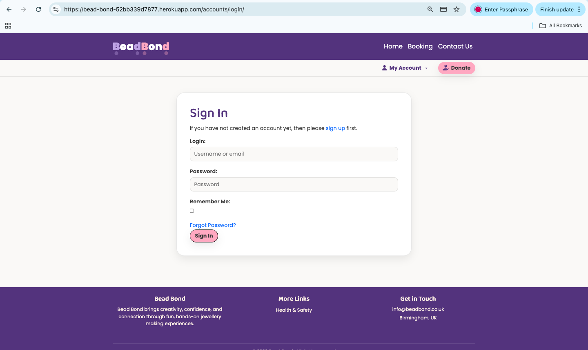  |
| **Workshop Booking System**       | Logged-in users can create bookings for jewellery workshops, select dates, and manage their bookings from a dedicated bookings page.                                         | 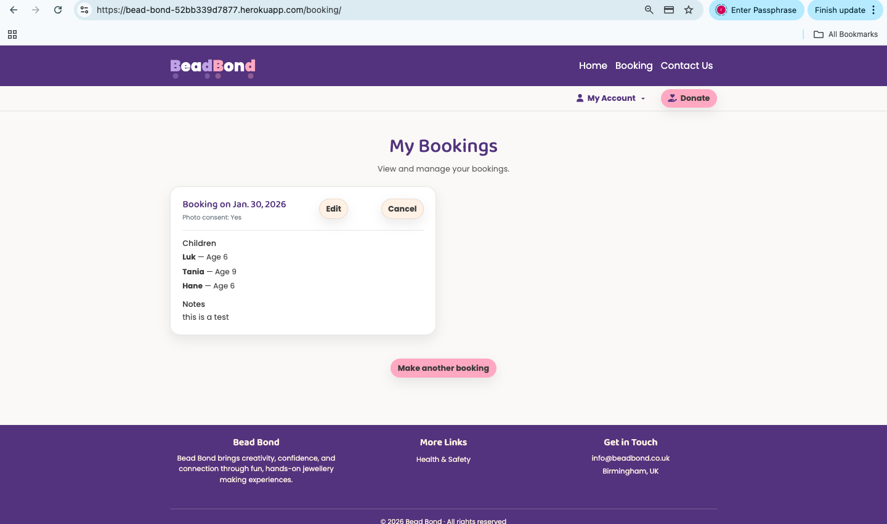 |
| **Multiple Children per Booking** | Parents can add more than one child to a single booking, making it easier for families to book workshops together.                                                 | 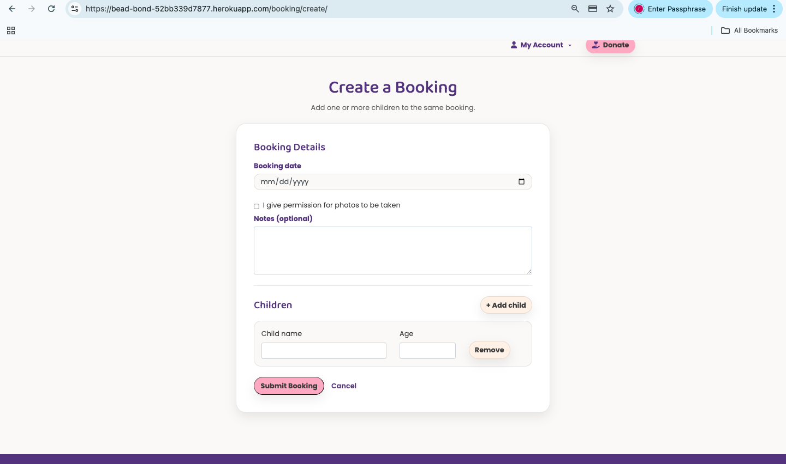    |
| **Edit Booking (Modal)**          | Users can edit an existing booking using a modal popup without leaving the bookings page, improving user experience.                                                         |  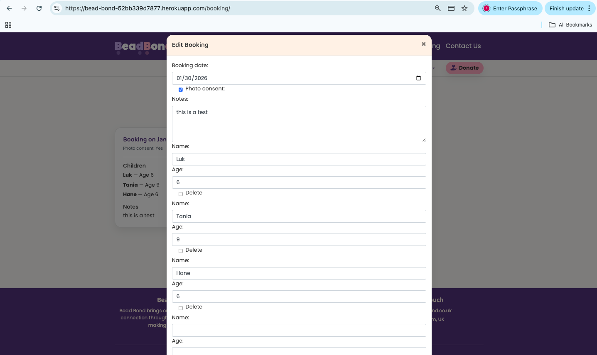    |
| **Cancel/Delete Booking**                | Users can cancel a booking they no longer need, helping keep booking data accurate and up to date.                                                                           |        |
| **Donation System**               | Users can support Bead Bond through secure online donations powered by Stripe Checkout.                                                                                      | 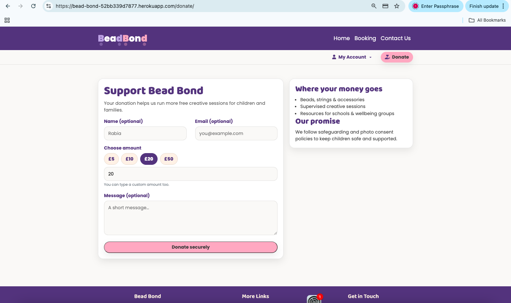          |
| **Contact Us Form**               | Visitors can contact Bead Bond using a contact form to ask questions or request more information about workshops.                                                            | 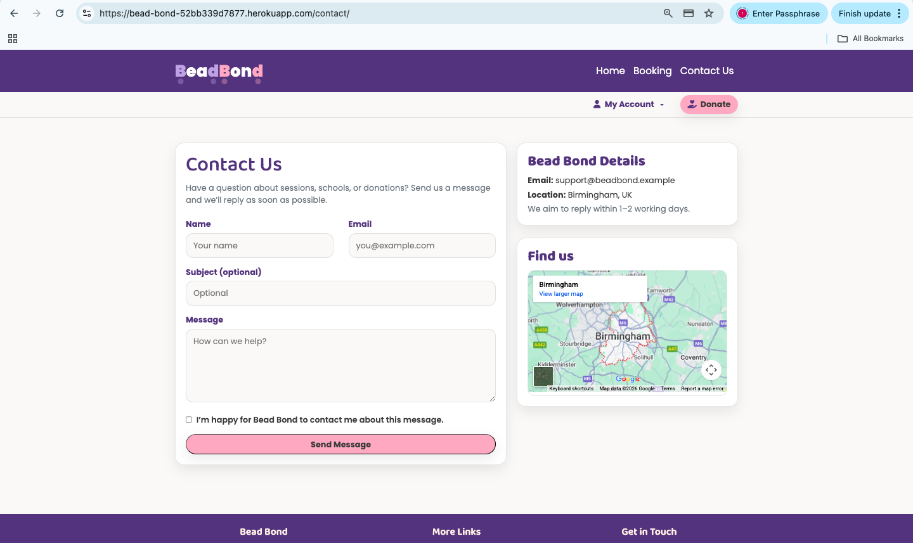        |
| **Health & Safety Page**          | A dedicated page outlining safety procedures, safeguarding policies, and child wellbeing commitments.                                                                        | |
| **Home**        | Carousel display what we do and all the included and not included products . | 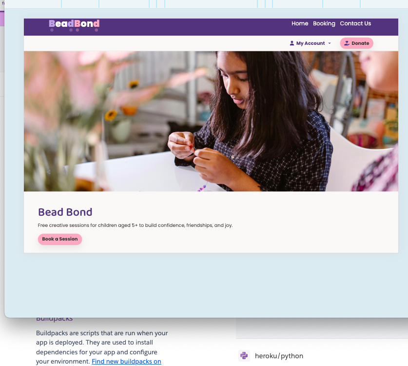  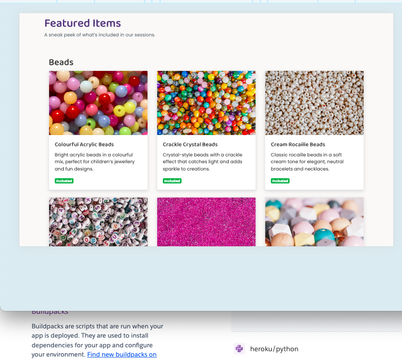 |                                              

[Back to contents](#contents)

## Bugs

| Bug                                                               | Cause                                                                         | Fix / Solution                                                                                                     |
| ----------------------------------------------------------------- | ----------------------------------------------------------------------------- | ----------------------------------------------------------------------------------------------------------------- |
| Booking saved without any children attached                       | Form allowed submission even if no child formset was completed.               | Added validation to require at least one child in the formset before saving the booking.                          |
| Deleted child still appeared after editing booking                | Formset was saved but deleted objects were not committed.                     | Called `formset.save()` after setting `formset.instance = booking`.                                               |
| Cancel button removed booking immediately without confirmation    | No user confirmation step before deletion.                                    | Added a confirmation prompt before submitting the cancel action.                                          |
| Photo consent defaulted to False even when checkbox ticked        | Checkbox value not correctly bound in the form.                               | Ensured the checkbox field was included in `fields` and properly saved in `form.save(commit=False)`.              |
| Stripe donation recorded even if payment failed                   | Donation object was created before Stripe confirmation.                       | Created donation records only after receiving a successful `checkout.session.completed` webhook event.            |
| Donation success page shown even when user closed Stripe checkout | Frontend redirected without verifying Stripe status.                          | Used Stripe success/cancel URLs properly and relied on webhook for final confirmation.                                           |
| Multiple children added but displayed as one                      | Template loop incorrectly referenced the booking instead of related children. | Corrected template logic to loop over `booking.children.all()`.                                                   |

## User Stories testing
| User Story                                                                         | Acceptance Criteria (What “Done” Looks Like)                               | Tested | Evidence                                           |
| ---------------------------------------------------------------------------------- | -------------------------------------------------------------------------- | ------ | -------------------------------------------------- |
| As a visitor, I can view the Home page so I understand what Bead Bond offers.      | Home loads without errors; hero/intro content visible; navigation works.   | Pass   |             |
| As a visitor, I can navigate the site using the navbar so I can find pages easily. | Navbar links go to correct pages; active links visible; works on mobile.   | Pass   | 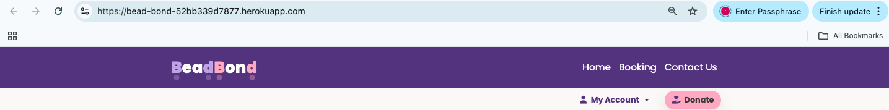      |
| As a user, I can register an account so I can access booking features.             | Sign-up form submits; account created; confirmation or redirect shown.     | Pass   | 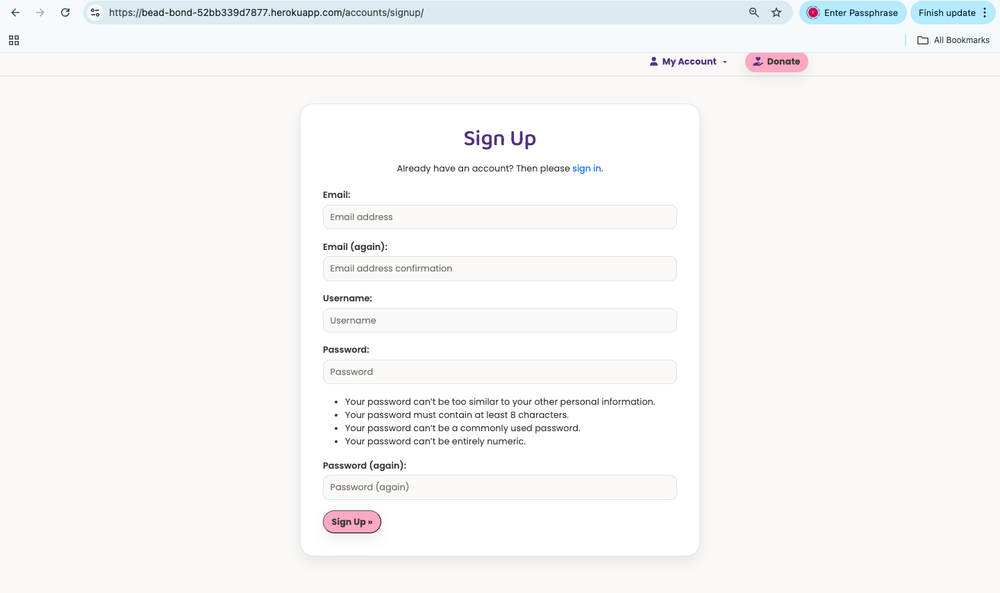           |
| As a user, I can log in so I can manage my bookings.                               | Login works with valid credentials; redirects correctly; session persists. | Pass   | 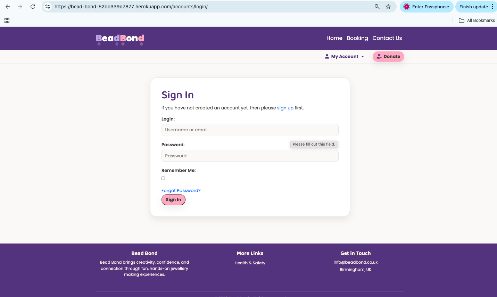              |
| As a user, I can access all “My Bookings” when logged in.                          | My Bookings page lists all past and future bookings.                       | Pass   |          |
| As a parent/guardian, I can create a booking so I can book an activity.            | Booking form saves; success message shown; booking appears in My Bookings. | Pass   | 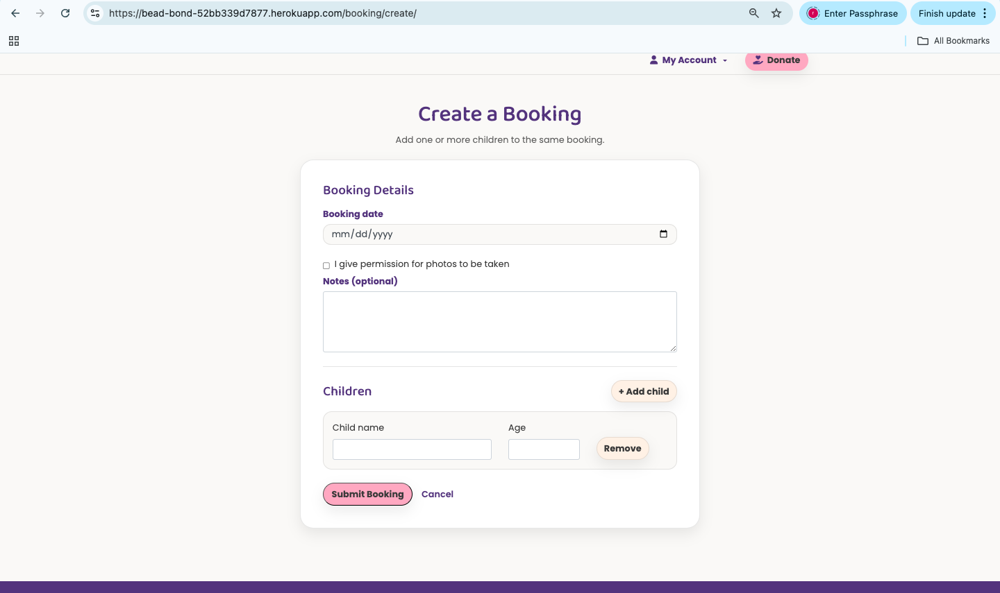     |
| As a parent/guardian, I can edit a booking so I can update details.                | Edit opens; fields pre-filled; saving updates booking correctly.           | Pass   | 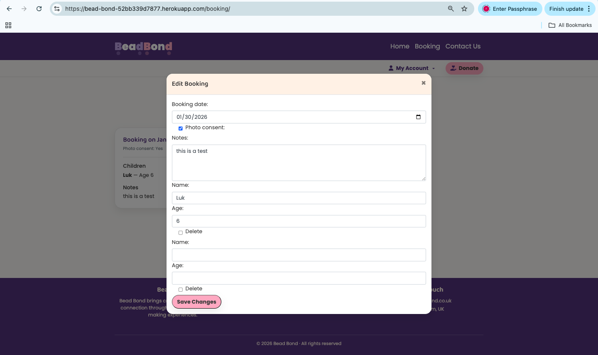 |
| As a parent/guardian, I can cancel/delete a booking so it no longer shows.         | Booking removed after confirmation; success message shown.                 | Pass   | 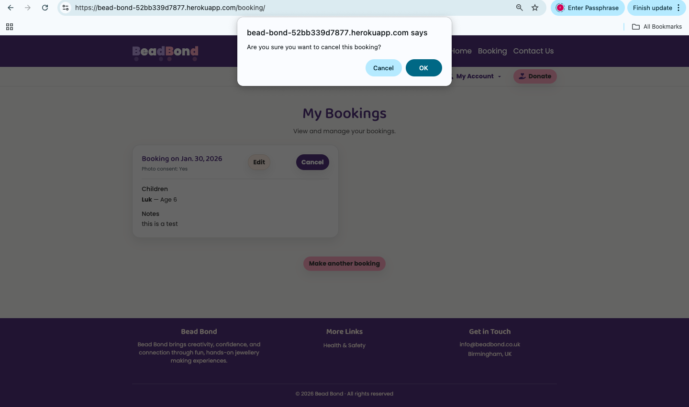     |
| As a user, I can see a message when I have no bookings yet.                        | “No bookings yet” message displayed with button to create booking.         | Pass   | 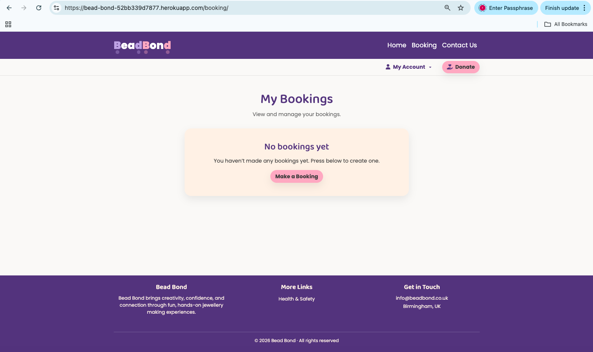      |
| As a donor, I can open the Donate page to understand how donations help.           | Donate page loads; explanation and form are visible.                       | Pass   | 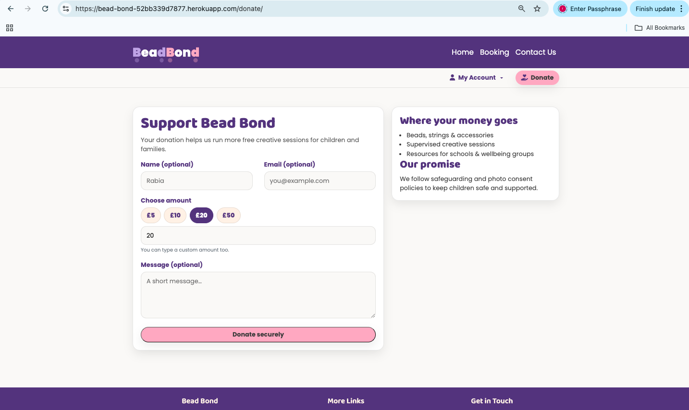             |
| As a donor, I can submit a donation and be redirected to Stripe Checkout.          | Clicking donate creates a session; redirects to Stripe Checkout.           | Pass   | 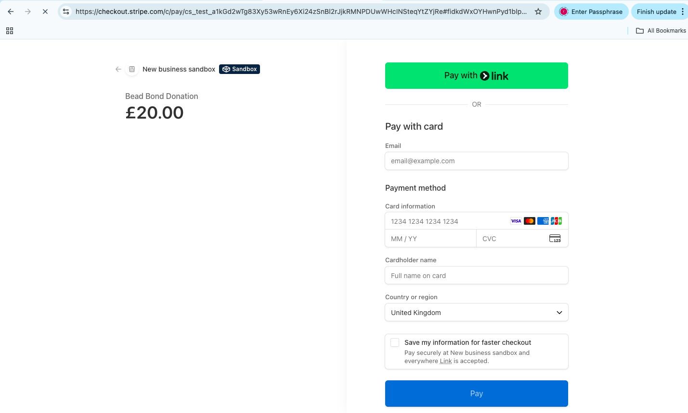    |
| As the site owner, I receive webhook events so donations can be confirmed.         | Webhook endpoint returns 200; `checkout.session.completed` handled.        | Pass   | 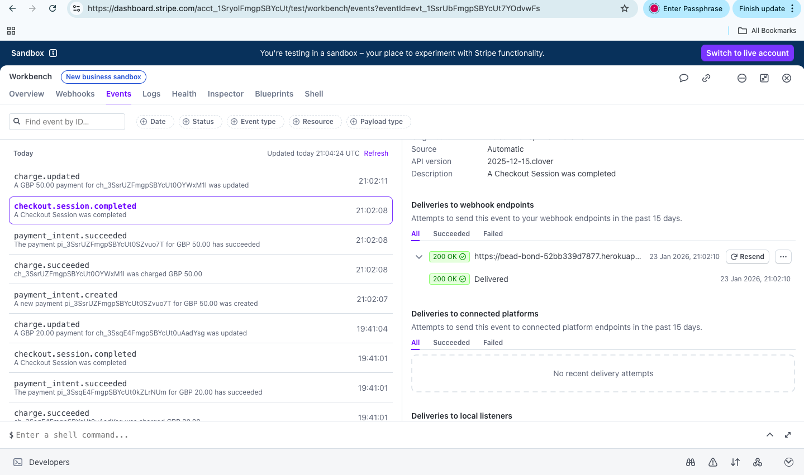      |
| As a visitor, I can contact Bead Bond to ask questions.                            | Contact form validates input; success message shown on submit.             | Pass   | 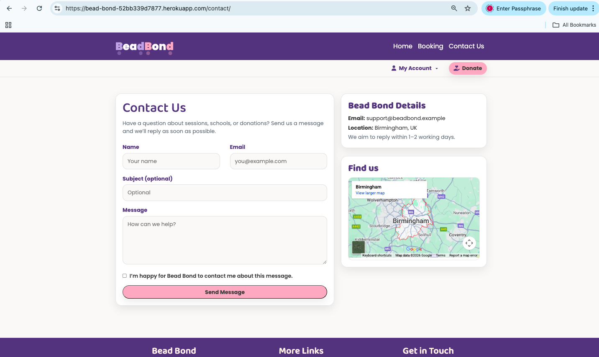     |
| As a visitor, I can view the Health & Safety page to feel confident.               | Page loads; content clear; accessible via footer/navigation.               | Pass   | 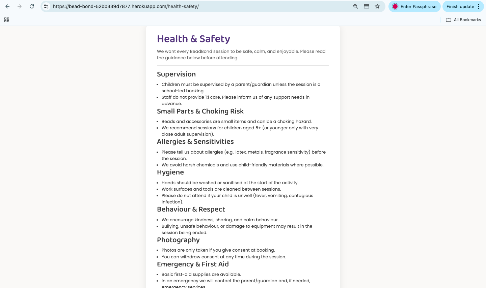      |
| As a user, I can log out to keep my account secure.                                | Logout ends session; user redirected to home or login page.                | Pass   | 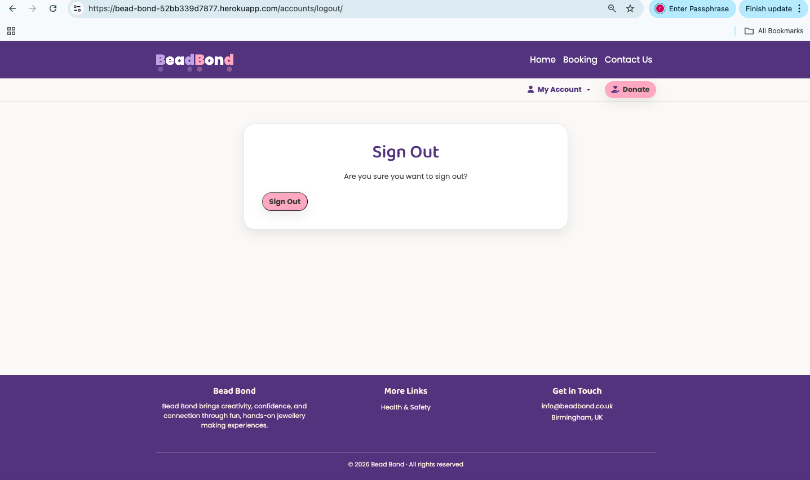           |

## Technologies Used

- [HTML](https://developer.mozilla.org/en-US/docs/Glossary/HTML5 "HTML")
- [CSS](https://developer.mozilla.org/en-US/docs/Web/CSS "CSS")
- [JS](https://developer.mozilla.org/en-US/docs/Web/JavaScript "JS")
- [Google Fonts](https://fonts.google.com/ "Google Fonts")
- [GitHub](https://github.com/ "GitHub")
- [Balsamiq](https://balsamiq.com/wireframes/ "Balsamiq")
- [Image Resize](https://squoosh.app/)
- [Color Contrast](https://contrastgrid.com/)
- [Stripe](https://stripe.com/gb)
- [Python](https://www.python.org/)
- [Colour Palette](https://coolors.co/)
- [W3C HTML Validation Service](https://validator.w3.org/ "W3C HTML")
- [W3C CSS Validation Service](https://jigsaw.w3.org/css-validator/ "W3C CSS")
- [JSHint](https://jshint.com/ "JSHint")
- [TOC Generator](https://ecotrust-canada.github.io/markdown-toc/ "TOC Generator")
- [Am I Responsive](https://ui.dev/amiresponsive "Am I responsive")
- [Responsive Design Checker](https://responsivedesignchecker.com/ "Responsive Design Checker")
- [WAVE Accessibility Tool](https://wave.webaim.org/ "WAVE Accessibility Tool")
- [Color Contrast Accessibility Validator](https://color.a11y.com/ "Color Contrast Accessibility Validator")

  [Back to contents](#contents)

## Deployment (Heroku)

- Create a Heroku app
- In Heroku Dashboard → New → Create new app
- Add a PostgreSQL database
- In Resources → Add-ons → search Heroku Postgres → add it
- Set Config Vars In Heroku → Settings → Reveal Config Vars, add: SECRET_KEY, DATABASE_URL (auto set by Postgres add-on), DEBUG = False, STRIPE_PUBLIC_KEY, STRIPE_SECRET_KEY, STRIPE_WEBHOOK_SECRET
- Install production dependencies
- Make sure these are in requirements.txt: gunicorn, whitenoise, psycopg2-binary, stripe, django-allaut
- Add a Procfile
- In the project root: web: gunicorn bead_bond.wsgi
- Collect static files
- Ensure in settings.py you have: STATIC_ROOT set, Whitenoise enabled in MIDDLEWARE, Push to Heroku, Connect GitHub in Heroku (Deploy tab) or push via terminal, Run migrations after deploy: heroku run python manage.py migrate
- Create a superuser.
- heroku run python manage.py createsuperuser

## Credits

Images from Pexels, Unsplash, and personal resources
Code Institute tutorials and mentor guidance
[ChatGBT](https://chatgpt.com/)
[Very Academy](//www.youtube.com/watch?v=oZwyA9lUwRk)
[Dennis Ivy – Django Forms & CRUD](https://www.youtube.com/watch?v=PtQiiknWUcI)

## Acknowledgements

To every child who needs a little spark, a little joy, and a little confidence 
this project is for you.

